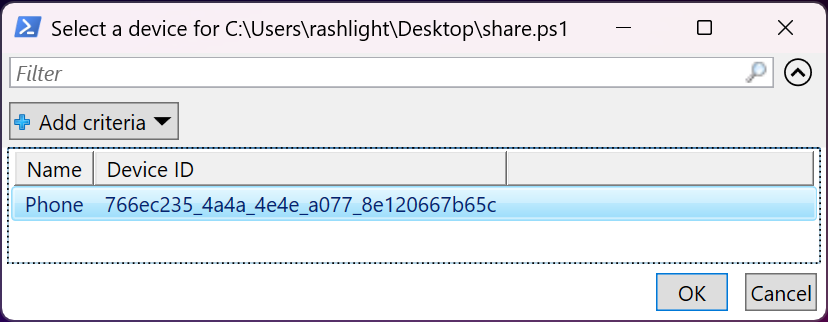

[KDE Connect](https://kdeconnect.kde.org/) is a very powerful tool that has become an essential part of my workflow. Recently I also discovered that it has its own command! Time to explore.


# Actions

The executable is `kdeconnectcli.exe`, which is installed by default in `C:\Program Files\KDE Connect\bin`.

To do any actions, locate a device name by invoking the `-l` flag:


\- Phone: 766ec235\_4a4a\_4e4e\_a077\_8e120667b65c (paired and reachable)

\- Desktop: \_f60ebfa6\_216c\_4eb2\_b834\_2d700ce18920\_ (paired)


Then, use the `-d` flag to specify the device ID, followed by the action flag. For example, to send a ping to my phone:



An action only works if the device is **paired** and **reachable**. Otherwise any actions will results in this error:

```
error: No such object path: '/modules/kdeconnect/devices/<device ID>/<action flag>'
```

Other interesting flags include:

 - `--ring`: Blast a loud sound.
 - `--refresh`: Reestablish connection and search for devices at the same time.
 - `--send-clipboard`: Send clipboard.
 - `--share <path/URL>` and `--share-text <text>`: Transfer data.
 - `--send-sms <message> --destination <phone number>`: Send an SMS (Android only, must grant permission first)
 - `--my-id`: Print your device ID

For more details, use the `-h` or `--help` flag. 

# Backends

To check which connection method is enabled, use `-b` or `--list-backend` flag.


BluetoothLinkProvider|enabled

LanLinkProvider|enabled


Output are self-explainatory. The `BluetoothLinkProvider` may not work with [old versions](https://github.com/KDE/kdeconnect-kde/commits/master/core/backends/bluetooth).

# Files Sending Context Menu

While featureful, sometimes interacting with the app, especially sharing files can be tedious. In Linux, the Cinnamon desktop (and by extension, Linux Mint) have [this action](https://cinnamon-spices.linuxmint.com/actions/view/5), which integrates it directly to the context menu of the file manager. The same can be achived with Windows by adding a registry key to the shell.

Unfortunately, KDE Connect does not provide interactible dialog to choose a device. Fortunately, `powershell` have the command `Out-GridView` which [show a selection dialog](https://learn.microsoft.com/en-us/powershell/module/microsoft.powershell.utility/out-gridview?view=powershell-7.5). Here are the steps to do so (modify instructions per your needs):


Modifying the registry can cause problems if not done carefully.


## Install

1. Open `regedit.exe`, navigate to `HKEY_CLASSES_ROOT\*\`. 
2. Create a new key by right-click on the `shell` key (folder) -> Key, name it `SendWithKDEConnect`. **Select that key**.
3. Change the `(Default)` value to "Send to KDE Connect" or any message you want.
4. Create a new String Value named `Icon` and set it to `C:\Program Files\KDE Connect\icon.ico` (Optional)
5. Create a new key on `SendWithKDEConnect` named `command`. Set the `(Default)` value to:

```plaintext
powershell.exe -WindowStyle Hidden -Command "& \"$env:ProgramFiles\\KDE Connect\\bin\\kdeconnect-cli.exe\" -d $((& \"$env:ProgramFiles\\KDE Connect\\bin\\kdeconnect-cli.exe\" -a) -split \"`r`n\" -replace \" \(.*\)|- |:\", \"\" | ForEach-Object { $parts = $_ -split \" +\", 2; [PSCustomObject]@{Name=$parts[0];\"Device ID\"=$parts[1]} } | Out-GridView -Title \"Select a device for %1\" -OutputMode Single).\"Device ID\" --share \"%1\""
```

6. Right-click on the file -> "Show more options" (Windows 11 only) -> Send with KDE Connect. A dialog will ask you to select a device. Click OK. The file will be sent on the receiving device.



## Uninstall

Open `regedit.exe` again, navigate to `HKEY_CLASSES_ROOT\*\shell\`. Right-click on `SendWithKDEConnect`, click Delete and confirm deletion.

# Ending notes

For elaboration, below is `powershell` version of command to type in your terminal to have functionality to the context menu. This one-liner removes the beginning dash, double-dot and "(paired and reachable)" text, renames the columns and open up a dialog, then sends files according to parameters.

```powershell
(& "$env:ProgramFiles\KDE Connect\bin\kdeconnect-cli.exe" 
  -d $((& "$env:ProgramFiles\KDE Connect\bin\kdeconnect-cli.exe" -a) 
  -split "`r`n" 
  -replace " \(.*\)|- |:", "" 
  | ForEach-Object { 
    $parts = $_ -split " +", 2; 
    [PSCustomObject]@{Name=$parts[0];"Device ID"=$parts[1]} } 
  | Out-GridView -Title "Select a device for $args" -OutputMode Single)."Device ID" --share $args)
```
If no suitable device is found, then it will prints: `Couldn't find device with id "--share"`

On further examination, it seems that some command-line flag that does not get integrated in the main user interface. Maybe that's experimental for now?